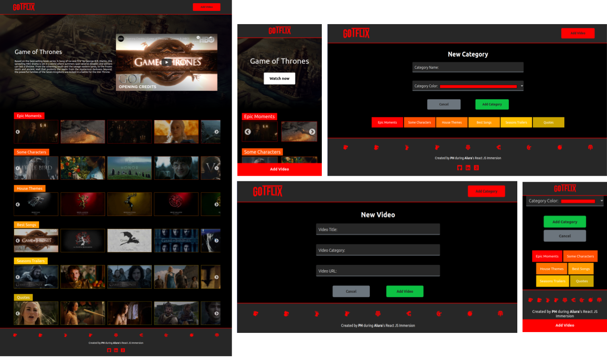

<h1 align="center">
    
</h1>

  <a href="#-deploy">Deploy</a>
  &nbsp;&nbsp;&nbsp;|&nbsp;&nbsp;&nbsp;
  <a href="#-projeto">Projeto</a>
  &nbsp;&nbsp;&nbsp;|&nbsp;&nbsp;&nbsp;
  <a href="#-tecnologias">Tecnologias</a>
  &nbsp;&nbsp;&nbsp;|&nbsp;&nbsp;&nbsp;
  <a href="#-scripts">Scripts</a>

    

## ✦ Deploy
Link para acesso ao Front-end: https://gotflix.vercel.app/

## ✦ Projeto

O projeto foi desenvolvido durante a Imersão React da <a href="https://www.alura.com.br/">Alura</a> e teve como objetivo a contrução de um SPA agregador de videos com um layout responsivo inspirado na Netflix.

## ✦ Tecnologias
Esse projeto foi desenvolvido com as seguintes tecnologias:

- [ReactJS](https://pt-br.reactjs.org/)
- [React Slick](https://react-slick.neostack.com/docs/example/simple-slider/)
- [styled components](https://styled-components.com/)
- [React Router](https://reactrouter.com/web/guides/quick-start)

## ✦ Scripts

Iniciar somente o server (dados da aplicação): `npm run server`
 
Iniciar a aplicação web [paralelamente](https://www.npmjs.com/package/concurrently) ao server: `npm run dev`

---

O projeto foi desenvolvido, para fins didáticos e aprendizado pessoal durante a Imersão React da <a href="https://www.alura.com.br/">Alura</a>

